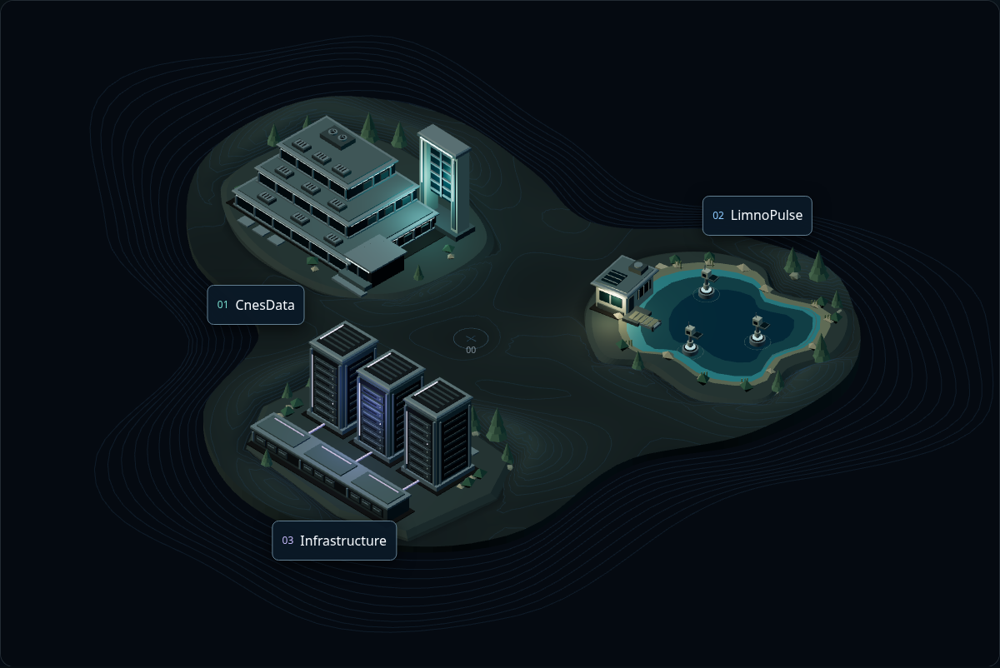
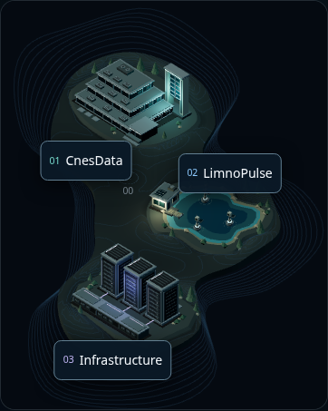
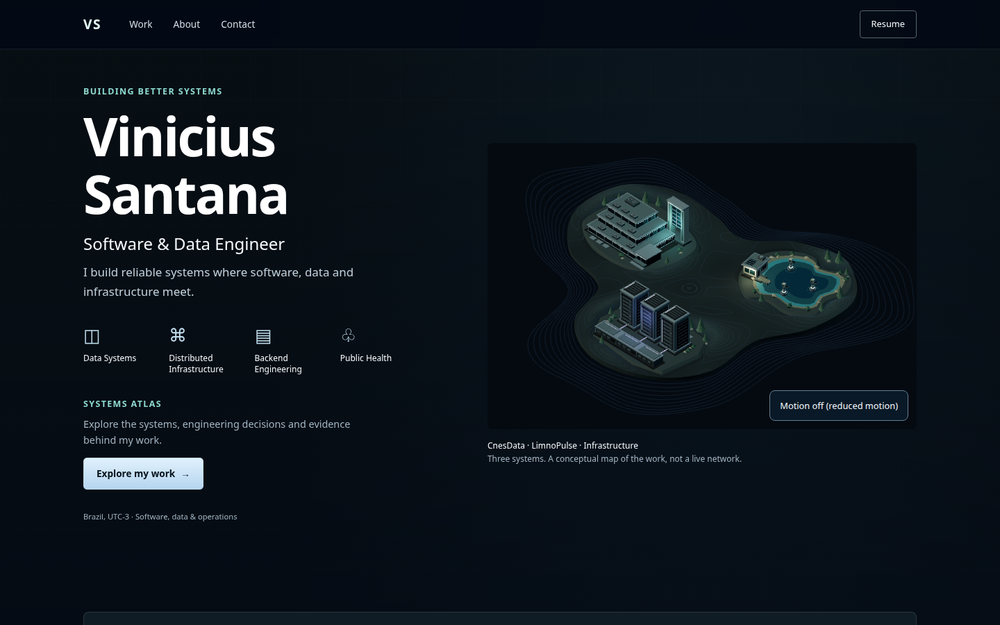

# Systems Atlas visual language V2

The Atlas and Home now share one continuous terrain and richer CnesData, LimnoPulse and Infrastructure maquettes. Restrained local lighting, rotating fans, complete buoy assemblies and water rings add ambient movement. The three project names remain native HTML links; the `00` origin is decorative.



| Mobile Atlas | Home |
| --- | --- |
|  |  |

[Visual reference](evidence/reference.png) · [Home mobile](evidence/home-mobile.png)

## Composition and interaction

- [atlas-authoring.json](../../../src/content/scenes/atlas-authoring.json) owns presentation parameters. [atlas-world.mjs](../../../src/features/explorer/scene/atlas-world.mjs) receives loaded models and visual parameters; the real GLB export/reload harness and both runtime presentations use that factory.
- [atlas-terrain.mjs](../../../src/features/explorer/scene/atlas-terrain.mjs) builds deterministic low relief, level contours and grouped vegetation. Decorative geometry is grouped by material without removing semantic district IDs or motion pivots. Detail assets and their source scenes are preserved.
- Local label anchors pass through each district's complete transform. HTML names are at least 14px with 44px targets. Canvas activation follows the existing link, including fragment, history, scroll and summary focus. Hover and keyboard focus remain separate from persistent selection.
- [motion-playback.ts](../../../src/features/explorer/scene/motion-playback.ts) owns one presentation's clock and Pause/Resume control. The first complete frame uses the authored poster pose. Native reduced-motion changes reset all transforms and disable animation; paused, hidden, offscreen and disposed presentations stop scheduling after settling. Visible animation is capped at 24fps.
- Camera limits, touch scrolling, Reset, selection on return to 2D, progressive Home activation, the single 15-second deadline and existing fallback/cancellation contracts remain covered by the browser suite.

## Real motion recordings

These recordings run at normal speed and include pause/resume through the keyboard. They depict decorative motion, not project traffic or a live simulation.

| Presentation | Desktop | Mobile |
| --- | --- | --- |
| Atlas | [Video](evidence/atlas-motion-1440x900.webm) | [Video](evidence/atlas-motion-390x844.webm) |
| Home | [Video](evidence/home-motion-1440x900.webm) | [Video](evidence/home-motion-390x844.webm) |

## Evidence scope

The images, recordings and measurements above come from the approved local lighting/motion iteration, before these Atlas-only changes were transferred onto current `main`. [manifest.json](evidence/manifest.json) records each retained artifact's original path, bytes and SHA-256. Complete earlier iteration history remains in the original local worktree; this PR contains a selected evidence set rather than every intermediate capture.

The historical corrected snapshot passed 112 browser cases, including 110 framing measurements from 320 to 1920px. Poster/runtime label displacement was 0 CSS px; selected outlines differed by at most 0.000031 CSS px. The native reduced-motion regression has preserved [failing](evidence/motion-fix-red.json) and [passing](evidence/motion-fix-green.json) evidence. Fresh verification against the current base is recorded in the PR and its CI checks, separately from these historical observations.

## Measured performance and limitations

The original baseline `773022d` and corrected visual candidate used the same Chromium 153/ANGLE SwiftShader host, cold cache, 10/1 Mbps, 40ms latency, CPU ×4 and DPR 1. Each condition had three primary visits. Renderer instrumentation ran in eight separate diagnostic visits; its modified responses do not enter the primary timing medians.

| Condition | Baseline scene ready | Corrected candidate | Change |
| --- | ---: | ---: | ---: |
| Atlas desktop | 1128.0ms | 1566.2ms | +38.8% |
| Atlas mobile | 1103.9ms | 1563.7ms | +41.7% |
| Home desktop | 1074.5ms | 1545.0ms | +43.8% |
| Home mobile | 1058.7ms | 1616.8ms | +52.7% |

All three samples in every condition crossed the 20% review trigger. The [independent disposition](evidence/performance-disposition.md) explicitly reviewed and accepted the richer-presentation tradeoff with this limitation; it did not turn the timing threshold into a numerical pass. There is no equivalent timing benchmark of the preceding approved rich checkpoint, so the full main-baseline increase cannot be attributed to the last lighting/motion delta. This round's models are 2.6% smaller than that rich checkpoint.

The measured Home FCP rose from 340/288ms to 408/344ms on desktop/mobile. Startup long tasks also increased. Active diagnostic rendering delivered approximately 3.4–12.7fps and occupied much of the software-rendering thread. A 24fps ceiling is not a smoothness or low-energy claim; physical mobile GPU and energy measurements were not performed. These are historical measurements of the recorded binaries, not a fresh benchmark of every subsequent `main` change.

The recorded resource and suspension gates passed:

| Metric | Observed | Limit |
| --- | ---: | ---: |
| Calls per render | 131 | 150 |
| Triangles per render | 18,072 | 100,000 |
| Four models plus external textures | 485,724 bytes; no external textures | 700,000 bytes |
| Desktop/mobile overview poster | 70,534 / 58,790 bytes | 220,000 / 150,000 bytes |
| Settled paused/reduced/hidden/offscreen draws | 0 | 0 |
| Detail/simulation requests on Atlas/Home | 0 | 0 |

Hidden-state diagnostics emulate the document visibility signal; offscreen diagnostics use real scroll and IntersectionObserver. They do not establish physical background-tab behavior. Visible running animation intentionally draws and is accounted for separately from stopped work.

[Baseline metrics](evidence/baseline-metrics.json) · [Corrected metrics](evidence/candidate-metrics.json) · [Comparison data](evidence/performance-comparison.json) · [Preserved first failed candidate](evidence/initial-failed-metrics.json) · [Source provenance](evidence/source-provenance.json)

The [full and partial generation audit](evidence/generation.json) reproduced all 22 assets and generated metadata exactly, preserved the 19 assets not requested by hub-only generation, and matched baseline detail assets. No files were copied back from the disposable audit. Original [baseline](evidence/baseline-inventory.json) and candidate [before](evidence/candidate-inventory-before.json)/[after](evidence/candidate-inventory-after.json) inventories remain unchanged.

## Verification commands

```sh
rtk npm test
rtk npm run build
rtk npm run smoke
rtk npm run test:explorer
rtk npm run gallery:verify
```

The Playwright configuration starts its own production preview; use an explicit `EXPLORER_BASE_URL` only for a separately built and verified preview when another task occupies the default port. Gallery verification similarly requires its default port to be free. The PR's local gallery run records any port-only adaptation without weakening assertions.

The retained [measurement script](evidence/measure.mjs) and [generation audit](evidence/check-generation.mjs) document the original collection. Reruns must use separate output paths and preserve their own source/build inventory; do not overwrite the historical records or mix measurements from different binaries. CI runs unit, build, static smoke and the complete browser suite for the PR commit before merge.
